# Cyber Apocalypse 2023

## Didactic Octo Paddles

> You have been hired by the Intergalactic Ministry of Spies to retrieve a powerful relic that is believed to be hidden within the small paddle shop, by the river.
> You must hack into the paddle shop's system to obtain information on the relic's location.
> Your ultimate challenge is to shut down the parasitic alien vessels and save humanity from certain destruction by retrieving the relic hidden within the Didactic Octo Paddles shop.
> 
> [`source_code`](web_didactic_octo_paddle.zip)

## Solution

First thing we'll do is browse the source code. We notice two things to get started;

One ) We see a "/register" POST function, so we have a vector to access the site, so let's do that;
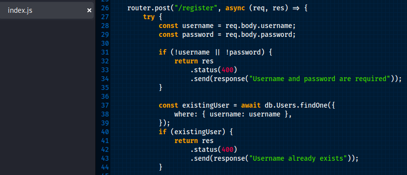 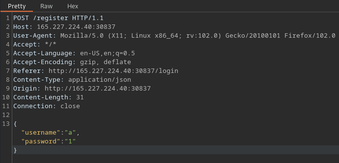

Two ) We find a "hidden" admin page;
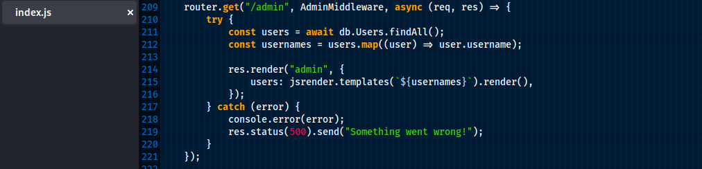

We can also see that the admin page is calling the function AdminMiddleware -- so let's check out what that does;
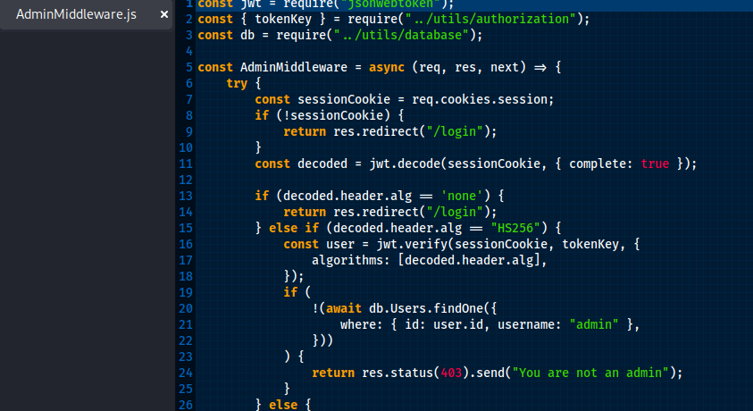

It looks like the authentication is only checking explicitly for **"none"** or HS256 as the JWT algorithms. Since it's explicitly only checking *"none"* we should be able to get away with CVE-2015-9235, so lets try that.
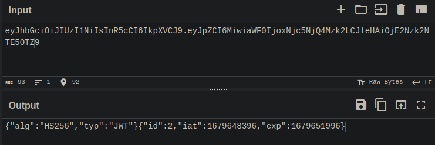 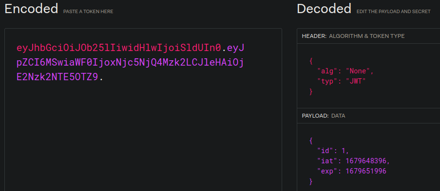

We want to grab our current JWT, and modify the "alg" to "None", as well as modify our "id" to "1" to spoof admin.

So now we want to craft a GET request to the /admin page using our modified JWT (remember to keep the trailing period on our nwe token).
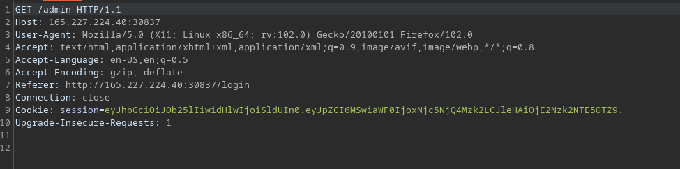 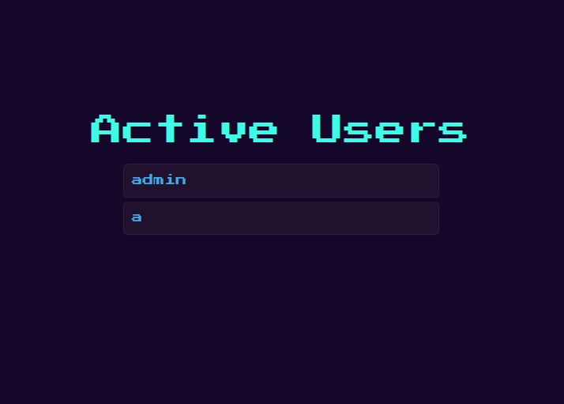

We don't see much here except a list of active users. Wandering back to our source code we find something really interesting in the admin.jsrender;
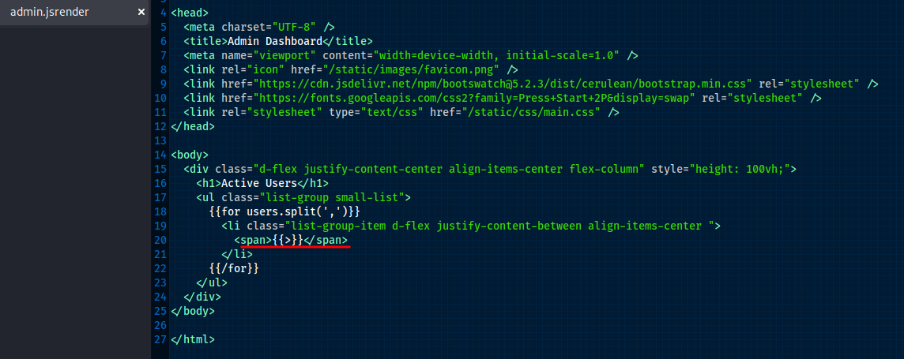

It looks like jsrender is evaluating usernames without sanitization, which leads it open to Server-Side Template Injection, or SSTI.

So let's find a jsrender specific payload for ssti, modify it to read /flag.txt, then register that as a new user.

Final payload *(don't forget to escape our double quotes with a backslash)*;
`{{:\"pwnd\".toString.constructor.call({},\"return global.process.mainModule.constructor._load('child_process').execSync('cat /flag.txt').toString()\")()}}`

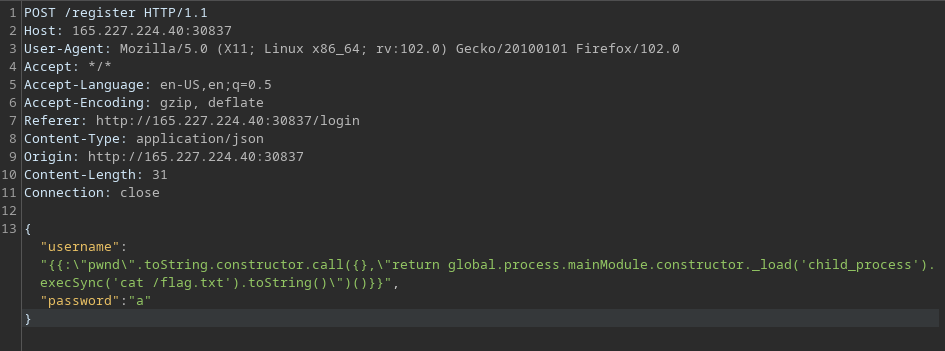

Reload our /admin page *(not forgetting to use your modified JWT)*;
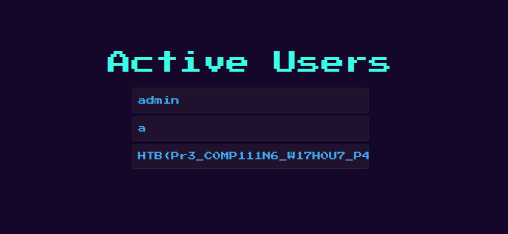

Flag `HTB{Pr3_C0MP111N6_W17H0U7_P4DD13804rD1N6_5K1115}`
