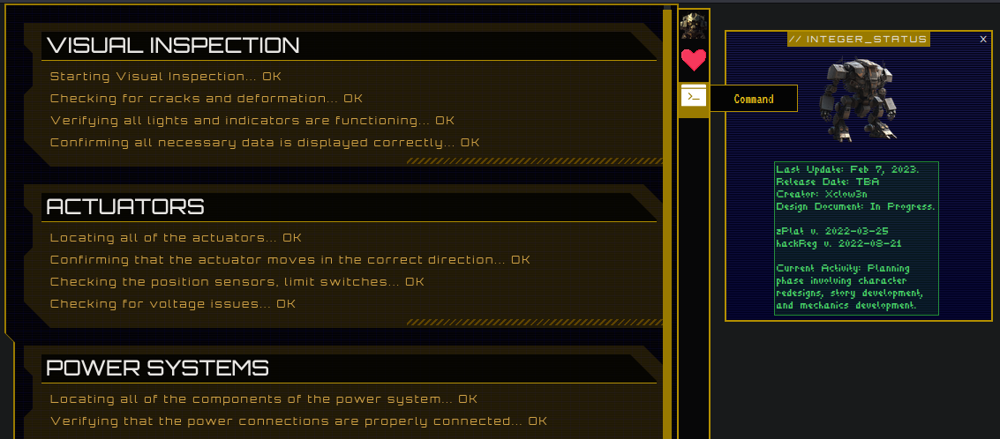
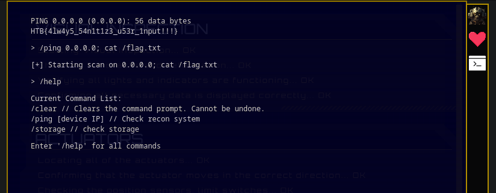

# Cyber Apocalypse 2023

## Gunhead

> During Pandora's training, the Gunhead AI combat robot had been tampered with and was now malfunctioning, causing it to become uncontrollable.
> With the situation escalating rapidly, Pandora used her hacking skills to infiltrate the managing system of Gunhead and urgently needs to take it down.
> 
> [`source_code`](web_gunhead.zip)

### Solution
Navigating to the site, right away we can see a shell is hosted.

The first thing we'll want to do is test sanitization of user input.

Running the help command we see what commands we have available to us. Se the first thing we try is adding a semicolon followed by our command to execute;

And just like that we obtained our flag

Flag `HTB{4lw4y5_54n1t1z3_u53r_1nput!!!}`
