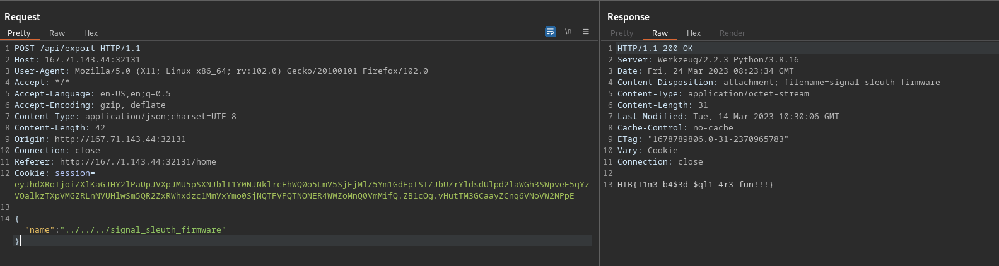

# Cyber Apocalypse 2023

## Orbital

> In order to decipher the alien communication that held the key to their location, she needed access to a decoder with advanced capabilities - a decoder that only The Orbital firm possessed.
> Can you get your hands on the decoder?
> 
> [`source_code`](web_orbital.zip)

## Solution

First thing we pick up while browsing the source code is the comment in the login function;

So we'll test that theory. Catch a request login with Burpsuite, save the request to a file and see what SQLmap can dump for us;

A few minutes and a couple prompts later we get an easy to crack hash;

Poking around on the site we find the export button that sends a post request to ther server. Trying a little directory traversal to retrieve /etc/passwd yields a promising return;

We can't find flag this way though, journeying back into the source we find out why;

Our modified request;

Flag `HTB{T1m3_b4$3d_$ql1_4r3_fun!!!}`
