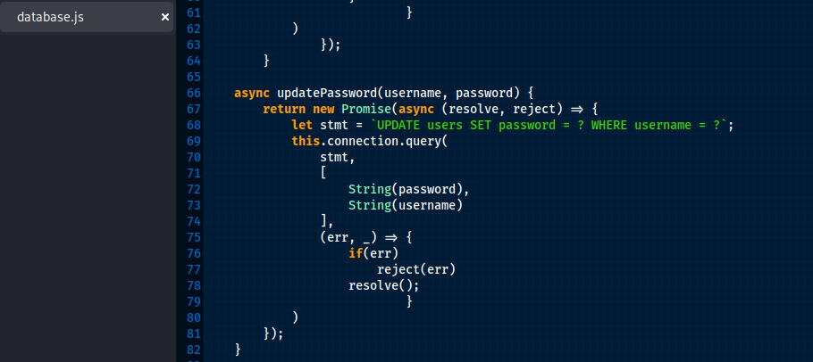
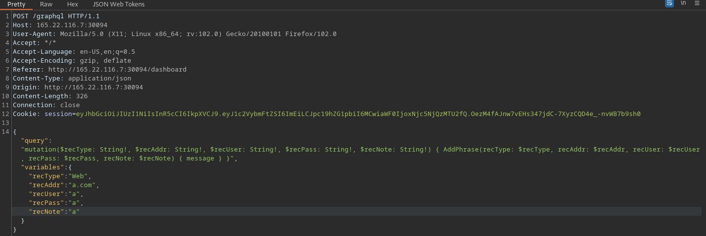
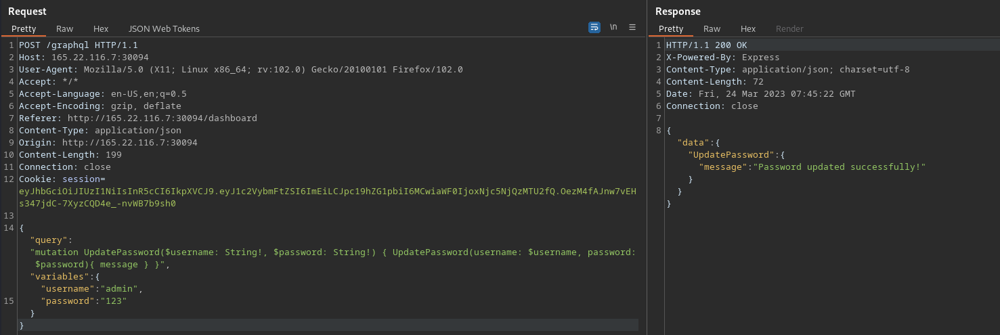
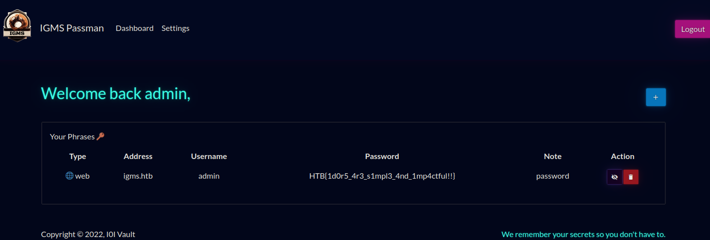

# Cyber Apocalypse 2023

## Passman

> Pandora discovered the presence of a mole within the ministry. To proceed with caution, she must obtain the master control password for the ministry, which is stored in a password manager.
> Can you hack into the password manager?
> 
> [`source_code`](web_passman.zip)

## Solution

Observing the source code we find a function in database.js to update users' passwords that only takes two arguments, a username and password, updating the password without authentication;

Exploring a little further in the source code and checking GraphqlHelper.js, we indeed see that the function only takes two arguments;

So the first thing we do is intercept a response for a basic post to see the structure of the request;

Next, we'll update the POST request with our target request (UpdatePassword) on our target user (admin);

And we get our "Updated successfully" respons so we know it worked!

Now we can log in with our newly set credentials for admin and get our flag;

Flag `HTB{1d0r5_4r3_s1mpl3_4nd_1mp4ctful!!}`
